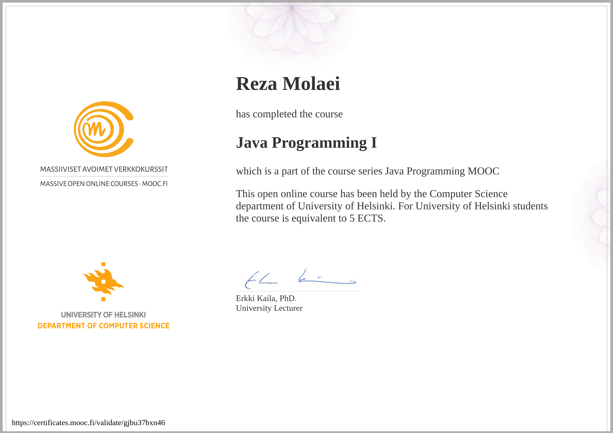

# java-programming-i
My answers to the exercises from the University of Helsinki’s Massive Open Online Course (MOOC) on object-oriented programming: Java Programming I.

Completed between 17 June 2026 and 12 August 2026

[Verify certificate](https://certificates.mooc.fi/validate/gjbu37bxn46)

# Certificate:

